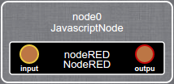

### NodeRED - kevoree-comp-nodered

This component is able to start a [Node-RED](http://nodered.org/) runtime.  
You can communicate with nodes inside your flows using the component input and output ports.

#### Overview of the component in the [Kevoree Web Editor](http://editor.kevoree.org)


#### Dictionary attributes
Name          | Optional      | Type          | Usage                                                       | Default value
------------- | ------------- | ------------- | ----------------------------------------------------------- | ---------------
flows         | true          | string        | this will be used to set your Node-RED flows (deploy full)  | _none_
httpAdminRoot | false         | string        | the root url for the Node-RED editor UI                     | "/"
httpNodeRoot  | false         | string        | the root url for nodes that provide HTTP endpoints          | "/api"
port          | false         | number        | the port used by the Node-RED editor express server         | 9090
userDir       | false         | string        | the directory to store all user data                        | _none_
nodesDir      | true         | string         | a directory to search for additional installed nodes (nodes must be available in [nodesDir]/nodes/)                        | _none_

#### KevScript example

```
// this is the minimal example possible
add node0: JavascriptNode
add node0.nodeRED: NodeRED
set node0.nodeRED.userDir = '/tmp/nodered'
```
